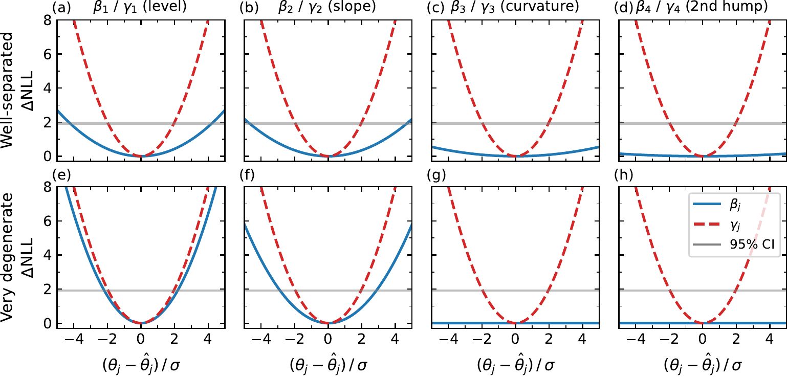

## Context — why the shape of the yield curve is hard to pin down {.smaller}

::: {.incremental}
- Interest rates depend on time-to-maturity: 1-month, 2-year, 30-year rates aren't independent — they form a **curve**.
- Central banks, pension funds, and risk desks all need a **compact, daily** description of this curve.
- The **Nelson–Siegel–Svensson (NSS)** model does it with four shape knobs:
  **level · slope · curvature · second hump**.
- Every business day: refit those four knobs from market data.
- Pain point: the knobs are **tangled** — turning curvature also affects the second hump. Daily fits jitter. Small data noise → large parameter uncertainty.
:::

::: {.callout-tip appearance="simple"}
**Why you should care in this room.** Same structural problem shows up whenever you regress on a nonlinear-in-λ basis with near-collinear columns — correlated CFD sensitivities, near-degenerate structural modes, anything VARPRO-shaped.
:::

## The Finding — a data-dependent orthogonal basis decouples the knobs {.smaller}

:::: {.columns}

::: {.column width="45%"}
**Formal**

- Thin QR on the design matrix:
  $$\Phi(\lambda) = \Psi(\lambda)\, R(\lambda), \quad \Psi^\top \Psi = I$$
- Reparameterize: $y \approx \Psi(\lambda)\, \gamma$, with $\gamma = R(\lambda)\, \beta$.
- Fisher information for $\gamma \mid \lambda$ is **exactly diagonal** — decorrelated, uniformly uncertain.
- Fit quality unchanged. Classical $\beta = R^{-1}\gamma$ on demand.

**ELI5.** New set of four knobs that don't interfere. Each one moves one independent direction. You can always translate back.
:::

::: {.column width="55%"}
{fig-align="center" width="100%"}

::: {.caption}
Profile negative log-likelihood. **Blue = classical β**, **red = orthogonal γ**. Top row: well-separated case (λ₁=0.6, λ₂=0.2). Bottom row: near-degenerate (λ₁=0.6, λ₂=0.59). Blue profiles go flat (non-identifiable); red profiles stay parabolic (identifiable). Grey line marks the 95% CI threshold.

*Source: Flassig, Gülay & Guterding (2026), arXiv:2604.19290, Fig. 6.*
:::
:::

::::

## How you got there — the math in one slide {.smaller}

**Model**
$$y(\tau; \beta, \lambda) = \beta_1 + \beta_2\, g_2(\tau, \lambda_1) + \beta_3\, g_3(\tau, \lambda_1) + \beta_4\, g_4(\tau, \lambda_2)$$

**Data model.** $y = \Phi(\lambda)\beta + \varepsilon$, $\varepsilon \sim \mathcal{N}(0, \sigma^2 I)$. Separable NLS — inner $\beta$ closed-form per $\lambda$ (variable projection).

**Diagnosis of instability.** $\Phi(\lambda)$ has near-collinear columns when $\lambda_1 \approx \lambda_2$ → $\operatorname{cond}(\Phi^\top\Phi)$ explodes → $\operatorname{Cov}(\hat\beta\mid\lambda) = \sigma^2 (\Phi^\top\Phi)^{-1}$ blows up on curvature & 2nd hump.

**Move.** Thin QR → $\Psi$ orthonormal (data-dependent, moves with $\lambda$). In $\gamma$-coordinates:
$$\operatorname{Cov}(\hat\gamma \mid \lambda) = \sigma^2\, I_4$$

**Joint (γ, λ) covariance.** Explicit Schur-complement form, $S = G^\top (I - \Psi\Psi^\top) G$, with $G = \partial\Phi/\partial\lambda \cdot \beta$.

**Bonus.** Continuous analytical orthogonalization on $[0, T]$ via closed-form $E_1$ integrals — grid-independent basis.

::: {.callout-note appearance="simple"}
**What didn't work first.** Fixing $\lambda$ (loses flexibility) · restricting parameter space (heuristic) · plain ridge on $\beta$ (helps but obscures identifiability). QR exposes the structure directly.
:::

## Why it matters — stable parameters, free diagnostic {.smaller}

- **Uncertainty wins (near-degenerate regime, synthetic):** Fisher std reductions of
  **slope 4.4×**, **curvature 9.4×**, **2nd hump 5.6×** tighter vs. classical $\beta$.
- **Real data (US Treasury, 1981–2026):** $\gamma$-series is **empirically smoother** than $\beta$-series for the same fit. Day-to-day basis rotation $\|\Psi(\lambda_{t-1})^\top \Psi(\lambda_t) - I\|_F$ stays tiny → $\gamma_t$ is usable as a time series.
- **Free diagnostic.** $|R_{44}|$ is a **scalar identifiability score**.
  $|R_{44}| \to 0 \Rightarrow$ 2nd hump is numerically redundant $\Rightarrow$ reduce NSS → NS. Automatic, no tuning.

::: {.callout-warning appearance="simple"}
**Honest limitation.** Uniform shrinkage in $\gamma$ is suboptimal vs. classical ridge in the degenerate regime. The orthogonal basis shines as a **diagnostic + model-selection tool**, not as a standalone regularizer.
:::

## The Challenge — where else does the untangling trick apply? {.smaller}

**ELI5 recap**

- Messy knobs in → clean, independent knobs out → free redundancy check.
- The trick: **data-dependent orthonormal basis via QR**, uniform uncertainty, scalar diagnostic on the last diagonal.

**Prompts for the room**

::: {.incremental}
- Where do **you** have near-collinear basis functions? Correlated CFD sensitivities? Nearly degenerate structural modes? Collinear ML feature columns?
- Does **$R_{44} \to 0$** generalize to your setting as an "over-parameterized" alarm?
- Other Schur-complement tricks you've seen for exposing conditioning structure?
:::

::: {.footer}
Source paper: Flassig, Gülay & Guterding (2026), *Orthogonal reparametrization of the Nelson–Siegel–Svensson interest rate curve model: conditioning, diagnostics, and identifiability.* arXiv:2604.19290 · JCAM submission.
:::
